```python
%load_ext autoreload
%autoreload 2
%matplotlib inline

#
# THE                                .-'''-.        .-'''-.                   
#                                   '   _    \     '   _    \                 
#_________   _...._               /   /` '.   \  /   /` '.   \                
#\        |.'      '-.           .   |     \  ' .   |     \  '   _.._         
# \        .'```'.    '. .-,.--. |   '      |  '|   '      |  '.' .._|        
#  \      |       \     \|  .-. |\    \     / / \    \     / / | '            
#   |     |        |    || |  | | `.   ` ..' /   `.   ` ..' /__| |__          
#   |      \      /    . | |  | |    '-...-'`       '-...-'`|__   __|         
#   |     |\`'-.-'   .'  | |  '-                               | |            
#   |     | '-....-'`    | |                                   | |            
#  .'     '.             | |                                   | |            
#'-----------'           |_|           _______                 | |            
#              __.....__               \  ___ `'.   .--.   _...|_|            
#          .-''         '.              ' |--.\  \  |__| .'     '.   .--./)   
#.-,.--.  /     .-''"'-.  `.            | |    \  ' .--..   .-.   . /.''\\    
#|  .-. |/     /________\   \    __     | |     |  '|  ||  '   '  || |  | |   
#| |  | ||                  | .:--.'.   | |     |  ||  ||  |   |  | \`-' /    
#| |  | |\    .-------------'/ |   \ |  | |     ' .'|  ||  |   |  | /("'`     
#| |  '-  \    '-.____...---.`" __ | |  | |___.' /' |  ||  |   |  | \ '---.   
#| |       `.             .'  .'.''| | /_______.'/  |__||  |   |  |  /'""'.\  
#| |         `''-...... -'   / /   | |_\_______|/       |  |   |  | ||     || 
#|_|                         \ \._,\ '/                 |  |   |  | \'. __//  
#                             `--'  `"                  '--'   '--'  `'---'   
#
#
#                                                               BENCHMARK
#

#
# AS REPORTED IN
#
# Haehn D, Knowles-Barley S, Roberts M, Beyer J, Kasthuri N, Lichtman JW, Pfister H. 
# Design and Evaluation of Interactive Proofreading Tools for Connectomics.
# IEEE Transactions on Visualization and Computer Graphics 2014;20(12):2466-2475.
#

import _proofreading as p
```

    The autoreload extension is already loaded. To reload it, use:
      %reload_ext autoreload


# Data


```python
#
# load the first slice of our test data
#
image, gold, segmentation = p.Util.load(0)
```


```python
p.Util.view(image, gold, segmentation)
```


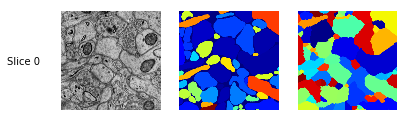


```python
#
# load all slices of our test data
#
images, golds, segmentations = p.Util.load_all()
```

    Loading..
    100%


```python
p.Util.view(images, golds, segmentations)
```


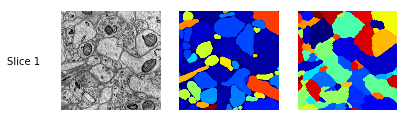


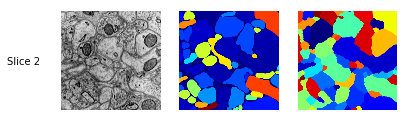


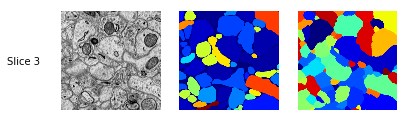


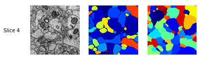


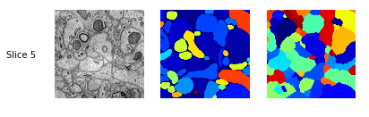


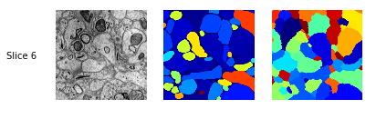


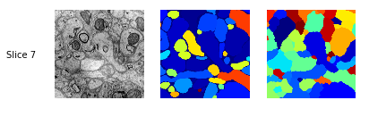


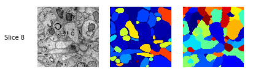


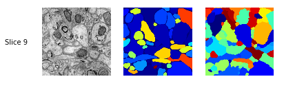


# Measures


```python
#
# variation of information of our test data
# Meila 2003, Comparing Clusterings by the Variation of Information
#
p.Util.variation_of_information(golds, segmentations)
```


    0.9760881507864134


```python
#
# Adjusted Rand score of our test data
# Rand 1971, Objective Criteria for the Evaluation of Clustering Methods
#
p.Util.rand_index(golds, segmentations)
```


    0.5135586522228454


```python
#
# Edit distance of our test data
# Returns number of 2d splits, number of 3d splits, number of 3d merges
# 
p.Util.edit_distance(golds, segmentations)
```


    (32, 6, 22)


```python
#
# Adapted Rand error as defined by http://brainiac2.mit.edu/SNEMI3D/evaluation
#
p.Util.adapted_rand_error(golds, segmentations)
```


    0.26752251818743578


# User Study


```python
# 
# Loads the participant information of the user study published in:
#
# Haehn 2014, Design and Evaluation of Interactive Proofreading Tools
#   for Connectomics, IEEE Vis
#
# Then, loads the proofreading results for each of the users and calculates the measures
# in comparison to the groundtruth manual segmentation.
#
users = p.Util.load_users()
p.Util.evaluate_users(users, golds)
```

    Loading..
    100%


```python
users
```


    [{'age': '26',
      'ed': 138,
      'id': 'S22',
      'occupation': 'Student CS',
      'rand_error': 0.44816396728277641,
      'ri': 0.38280034780100564,
      'sex': 'F',
      'tool': 'Raveler',
      'vi': 1.2933364834794254,
      'vi_error': 1.8038716340906906},
     {'age': '26',
      'ed': 59,
      'id': 'S23',
      'occupation': 'Administrative Assistant',
      'rand_error': 0.32092370492884148,
      'ri': 0.47559041583575734,
      'sex': 'F',
      'tool': 'Raveler',
      'vi': 1.0748483872514658,
      'vi_error': 1.8491500558202447},
     {'age': '28',
      'ed': 151,
      'id': 'S31',
      'occupation': 'Biomedical Engineer',
      'rand_error': 0.48239513920191812,
      'ri': 0.3512435745242203,
      'sex': 'F',
      'tool': 'Raveler',
      'vi': 1.6594483029723834,
      'vi_error': 1.7712508988767581},
     {'age': '31',
      'ed': 63,
      'id': 'S33',
      'occupation': 'Mother',
      'rand_error': 0.28628585303352172,
      'ri': 0.4981098578443215,
      'sex': 'F',
      'tool': 'Raveler',
      'vi': 1.102054857345654,
      'vi_error': 1.8509841238857514},
     {'age': '29',
      'ed': 48,
      'id': 'S38',
      'occupation': 'Fellow Research BWH',
      'rand_error': 0.20230866787687518,
      'ri': 0.5651017268169658,
      'sex': 'M',
      'tool': 'Raveler',
      'vi': 0.8581251626839457,
      'vi_error': 1.8792809244930395},
     {'age': '',
      'ed': 59,
      'id': 'S41',
      'occupation': 'Scientist',
      'rand_error': 0.25450825324543214,
      'ri': 0.5223376066695159,
      'sex': 'M',
      'tool': 'Raveler',
      'vi': 0.8985669190647014,
      'vi_error': 1.8731280754190462},
     {'age': '39',
      'ed': 67,
      'id': 'S46',
      'occupation': 'Admin',
      'rand_error': 0.27645168606833892,
      'ri': 0.5116580107733378,
      'sex': 'F',
      'tool': 'Raveler',
      'vi': 0.9424156714919185,
      'vi_error': 1.8641809553013156},
     {'age': '26',
      'ed': 94,
      'id': 'S51',
      'occupation': 'Law Student',
      'rand_error': 0.33796410464485027,
      'ri': 0.46108276263296305,
      'sex': 'F',
      'tool': 'Raveler',
      'vi': 1.245336661539409,
      'vi_error': 1.8267949247843651},
     {'age': '32',
      'ed': 70,
      'id': 'S54',
      'occupation': 'Economist',
      'rand_error': 0.28220638652068319,
      'ri': 0.5028071351387999,
      'sex': 'F',
      'tool': 'Raveler',
      'vi': 1.0117972281902992,
      'vi_error': 1.8591611852006649},
     {'age': '28',
      'ed': 88,
      'id': 'S1',
      'occupation': 'Student',
      'rand_error': 0.37350938713666948,
      'ri': 0.4313913501632748,
      'sex': 'F',
      'tool': 'Mojo',
      'vi': 1.3988405224938125,
      'vi_error': 1.816278353616313},
     {'age': '34',
      'ed': 64,
      'id': 'S12',
      'occupation': 'Post Doc',
      'rand_error': 0.30337604679245556,
      'ri': 0.4852545394608464,
      'sex': 'F',
      'tool': 'Mojo',
      'vi': 1.1417752362887397,
      'vi_error': 1.8462496942928177},
     {'age': '27',
      'ed': 62,
      'id': 'S14',
      'occupation': 'Social Worker',
      'rand_error': 0.27291022601238568,
      'ri': 0.5093701126794565,
      'sex': 'F',
      'tool': 'Mojo',
      'vi': 1.0471267370163782,
      'vi_error': 1.8569485543030855},
     {'age': '37',
      'ed': 69,
      'id': 'S21',
      'occupation': 'Economist',
      'rand_error': 0.2897910970826324,
      'ri': 0.4954790826541948,
      'sex': 'M',
      'tool': 'Mojo',
      'vi': 1.1334794092032627,
      'vi_error': 1.8484193818521542},
     {'age': '30',
      'ed': 61,
      'id': 'S36',
      'occupation': 'Student (applied Physics)',
      'rand_error': 0.29160695270073922,
      'ri': 0.49429951531601296,
      'sex': 'M',
      'tool': 'Mojo',
      'vi': 1.0741744714295614,
      'vi_error': 1.8535862127704523},
     {'age': '23',
      'ed': 62,
      'id': 'S42',
      'occupation': 'Medical Student',
      'rand_error': 0.28492572102479774,
      'ri': 0.5002508002475611,
      'sex': 'M',
      'tool': 'Mojo',
      'vi': 1.1068883624566102,
      'vi_error': 1.8500280985279152},
     {'age': '40',
      'ed': 65,
      'id': 'S49',
      'occupation': 'HR Consultant',
      'rand_error': 0.27962070965381414,
      'ri': 0.5035647616020137,
      'sex': 'F',
      'tool': 'Mojo',
      'vi': 1.0707135450950673,
      'vi_error': 1.8545079050267681},
     {'age': '20',
      'ed': 46,
      'id': 'S52',
      'occupation': 'Student',
      'rand_error': 0.28738306389619783,
      'ri': 0.4970451036797945,
      'sex': 'F',
      'tool': 'Mojo',
      'vi': 1.0300624281569908,
      'vi_error': 1.8597975234788855},
     {'age': '23',
      'ed': 49,
      'id': 'S60',
      'occupation': 'CS Grad Student',
      'rand_error': 0.26338173534295684,
      'ri': 0.516610507071466,
      'sex': 'F',
      'tool': 'Mojo',
      'vi': 0.9835024532487839,
      'vi_error': 1.8656142035610639},
     {'age': '22',
      'ed': 62,
      'id': 'S11',
      'occupation': 'Graduate Student CS',
      'rand_error': 0.22340708769474449,
      'ri': 0.5495048843528688,
      'sex': 'M',
      'tool': 'Dojo',
      'vi': 0.8687744295221593,
      'vi_error': 1.8753824656508811},
     {'age': '23',
      'ed': 62,
      'id': 'S13',
      'occupation': 'Research Assistant',
      'rand_error': 0.29635632613799701,
      'ri': 0.49265173802710216,
      'sex': 'F',
      'tool': 'Dojo',
      'vi': 1.0280295019601953,
      'vi_error': 1.8570188474345524},
     {'age': '27',
      'ed': 61,
      'id': 'S18',
      'occupation': 'Graduate Student Environmental Engineering',
      'rand_error': 0.25350002573403985,
      'ri': 0.5253270384754347,
      'sex': 'M',
      'tool': 'Dojo',
      'vi': 0.8772470205154432,
      'vi_error': 1.8741786839538419},
     {'age': '27',
      'ed': 51,
      'id': 'S37',
      'occupation': 'Student (Public Policy)',
      'rand_error': 0.25741501382359988,
      'ri': 0.5213495081691579,
      'sex': 'M',
      'tool': 'Dojo',
      'vi': 0.9228280267376956,
      'vi_error': 1.8713416684941901},
     {'age': '',
      'ed': 89,
      'id': 'S40',
      'occupation': 'unemployed (trained Software Engineer)',
      'rand_error': 0.30829223702993758,
      'ri': 0.4910190316146676,
      'sex': 'F',
      'tool': 'Dojo',
      'vi': 1.0079764563255056,
      'vi_error': 1.8517772949279943},
     {'age': '30',
      'ed': 40,
      'id': 'S43',
      'occupation': 'Software Developer',
      'rand_error': 0.23723955921136786,
      'ri': 0.5358082606256814,
      'sex': 'M',
      'tool': 'Dojo',
      'vi': 0.8485155086323086,
      'vi_error': 1.8808140113002754},
     {'age': '20',
      'ed': 110,
      'id': 'S5',
      'occupation': 'Student',
      'rand_error': 0.31380315244621637,
      'ri': 0.47763442914613075,
      'sex': 'F',
      'tool': 'Dojo',
      'vi': 1.0727786456217796,
      'vi_error': 1.845794682332988},
     {'age': '24',
      'ed': 37,
      'id': 'S50',
      'occupation': 'Grad Student (Applied Physics)',
      'rand_error': 0.18666757498646491,
      'ri': 0.5767471577615848,
      'sex': 'M',
      'tool': 'Dojo',
      'vi': 0.7849292607703333,
      'vi_error': 1.889460386971382},
     {'age': '31',
      'ed': 47,
      'id': 'S53',
      'occupation': 'Instructor HMS',
      'rand_error': 0.24030443485936459,
      'ri': 0.5347656467546015,
      'sex': 'M',
      'tool': 'Dojo',
      'vi': 0.8773981851507227,
      'vi_error': 1.8769685981602104},
     {'age': '23',
      'ed': 32,
      'id': 'S62',
      'occupation': 'PhD Student in CS',
      'rand_error': 0.18575384300223308,
      'ri': 0.5782388371350298,
      'sex': 'M',
      'tool': 'Dojo',
      'vi': 0.7526550715316169,
      'vi_error': 1.8932242494298641}]


```python
#
# We calculate the VI, RI, ED, Rand Error, and VI Error measures per tool.
#
measures = p.Util.group_users_by_tool(users)
```


```python
#
# Variation of Information across tools
#
p.Util.plot_metric('Variation of Information', p.Util.variation_of_information(golds, segmentations), measures['vi'])
```


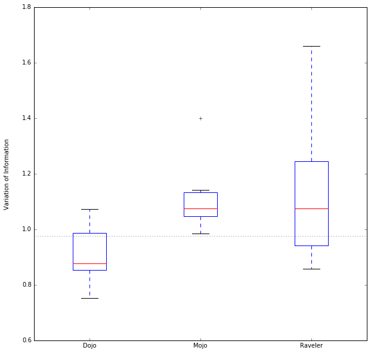


```python
#
# Rand index across tools
#
p.Util.plot_metric('Rand Index', p.Util.rand_index(golds, segmentations), measures['ri'])
```


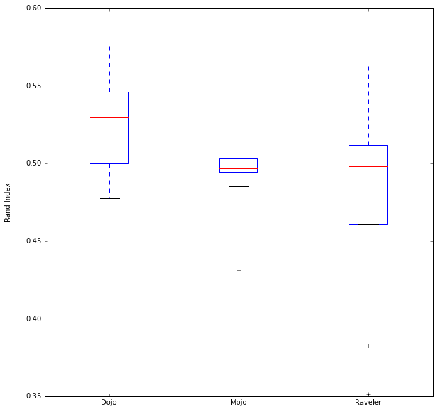


```python
#
# Edit Distance across tools (sum of 2d splits + 3d merges)
#
ed_baseline = p.Util.edit_distance(golds, segmentations)
ed_baseline = ed_baseline[0] + ed_baseline[2] # 2d splits and 3d merges (see Haehn 2014)
p.Util.plot_metric('Edit Distance', ed_baseline, measures['ed'])
```


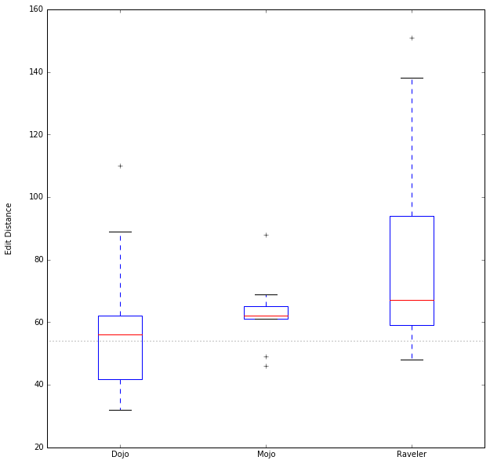


```python
#
# Adapted Rand error across tools
#
p.Util.plot_metric('Adapted Rand Error', p.Util.adapted_rand_error(golds, segmentations), measures['rand_error'])
```


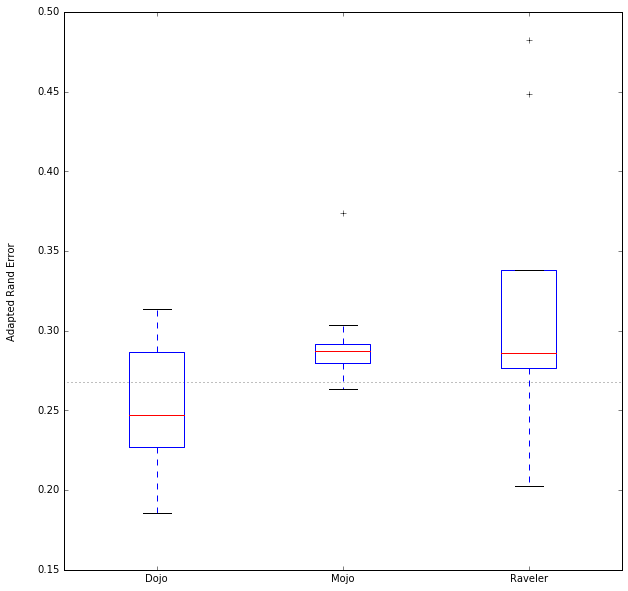


```python

```
